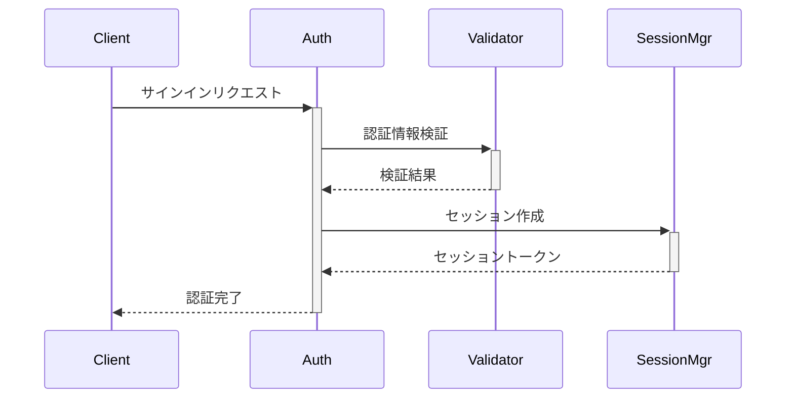
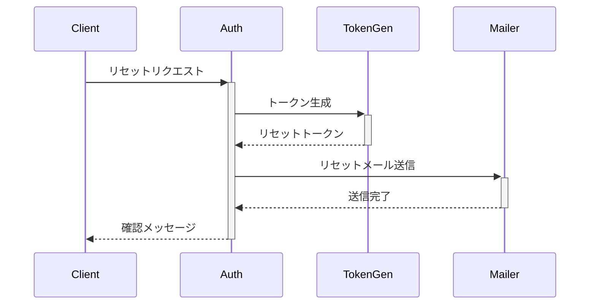

# Authentication System Design Document

## Design Principles

### 1. セキュリティ (Security)
- 最新のセキュリティベストプラクティス
- 多層防御アプローチ
- 定期的なセキュリティ監査

### 2. 使いやすさ (Usability)
- シンプルな認証フロー
- 明確なエラーメッセージ
- 段階的なセキュリティ強化

### 3. 柔軟性 (Flexibility)
- 複数の認証プロバイダー対応
- カスタマイズ可能なセキュリティポリシー
- 拡張可能なアーキテクチャ

### 4. 信頼性 (Reliability)
- 堅牢なエラーハンドリング
- 高可用性設計
- 監査ログの保持

## System Architecture

### 1. コンポーネント構成

```
Auth System
├── Providers
│   ├── Credentials
│   ├── OAuth
│   └── Email
├── Session Management
│   ├── JWT Handler
│   └── State Manager
├── Security
│   ├── Password Manager
│   ├── Rate Limiter
│   └── Audit Logger
└── Error Handling
    ├── Error Manager
    └── Recovery Handler
```

### 2. データフロー

#### サインインフロー


#### パスワードリセットフロー


## Security Measures

### 1. パスワードポリシー

```typescript
interface PasswordPolicy {
  // 最小長
  minLength: 12,
  
  // 文字種別要件
  requirements: {
    uppercase: true,    // 大文字
    lowercase: true,    // 小文字
    numbers: true,      // 数字
    symbols: true,      // 記号
  },
  
  // パスワード有効期限
  expirationDays: 90,
  
  // 履歴チェック
  historySize: 5,
}
```

### 2. レート制限設定

```typescript
interface RateLimitConfig {
  // ログイン試行
  login: {
    maxAttempts: 5,
    windowMs: 900000,  // 15分
    blockDuration: 3600000,  // 1時間
  },
  
  // パスワードリセット
  passwordReset: {
    maxAttempts: 3,
    windowMs: 3600000,  // 1時間
    blockDuration: 86400000,  // 24時間
  },
  
  // APIリクエスト
  api: {
    maxRequests: 100,
    windowMs: 60000,  // 1分
  },
}
```

### 3. セッション管理

```typescript
interface SessionConfig {
  // JWTの設定
  jwt: {
    secret: string,
    signingKey: string,
    encryptionKey: string,
    algorithm: 'HS256' | 'RS256',
  },
  
  // セッション設定
  session: {
    strategy: 'jwt',
    maxAge: 86400,  // 24時間
    updateAge: 3600,  // 1時間
  },
  
  // Cookieの設定
  cookie: {
    secure: true,
    sameSite: 'lax',
    path: '/',
    domain: 'example.com',
  },
}
```

## Error Management

### 1. エラーカテゴリ

```typescript
enum ErrorCategory {
  // 認証エラー
  AUTH_ERROR = 'auth',
  
  // 入力検証エラー
  VALIDATION_ERROR = 'validation',
  
  // セッションエラー
  SESSION_ERROR = 'session',
  
  // システムエラー
  SYSTEM_ERROR = 'system',
}
```

### 2. エラーレスポンス

```typescript
interface ErrorResponse {
  // エラー情報
  error: {
    code: string,
    message: string,
    category: ErrorCategory,
    details?: any,
  },
  
  // ユーザー向けメッセージ
  userMessage: string,
  
  // リカバリーアクション
  actions?: {
    primary?: string,
    secondary?: string,
  },
}
```

## Monitoring & Logging

### 1. 監査ログ

```typescript
interface AuditLog {
  // イベント情報
  event: {
    type: string,
    severity: 'info' | 'warning' | 'error',
    timestamp: Date,
  },
  
  // ユーザー情報
  user: {
    id?: string,
    ip: string,
    userAgent: string,
  },
  
  // コンテキスト
  context: {
    resource: string,
    action: string,
    result: string,
  },
}
```

### 2. メトリクス

```typescript
interface AuthMetrics {
  // アクティビティ
  activity: {
    loginAttempts: number,
    successfulLogins: number,
    failedLogins: number,
    passwordResets: number,
  },
  
  // パフォーマンス
  performance: {
    avgLoginTime: number,
    avgTokenGenTime: number,
    avgValidationTime: number,
  },
  
  // セキュリティ
  security: {
    blockedIPs: number,
    suspiciousActivities: number,
    rateLimit: {
      current: number,
      max: number,
    },
  },
}
```

## Testing Strategy

### 1. セキュリティテスト
- 脆弱性スキャン
- ペネトレーションテスト
- セキュリティ監査

### 2. 機能テスト
- 認証フローのテスト
- エッジケーステスト
- 統合テスト

### 3. パフォーマンステスト
- 負荷テスト
- ストレステスト
- キャパシティテスト

## Documentation

### 1. API仕様
- エンドポイント定義
- リクエスト/レスポンス形式
- エラーコード

### 2. セキュリティガイドライン
- パスワードポリシー
- セキュリティベストプラクティス
- インシデント対応手順

### 3. 運用マニュアル
- 監視手順
- バックアップ/リストア
- トラブルシューティング
