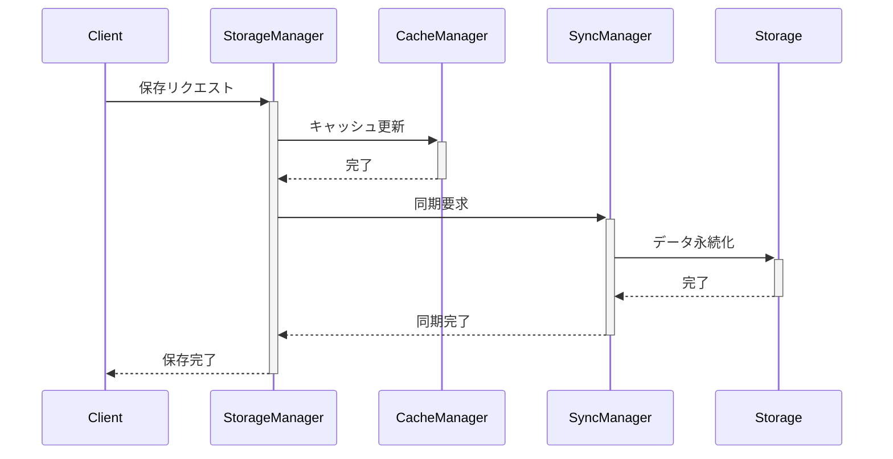
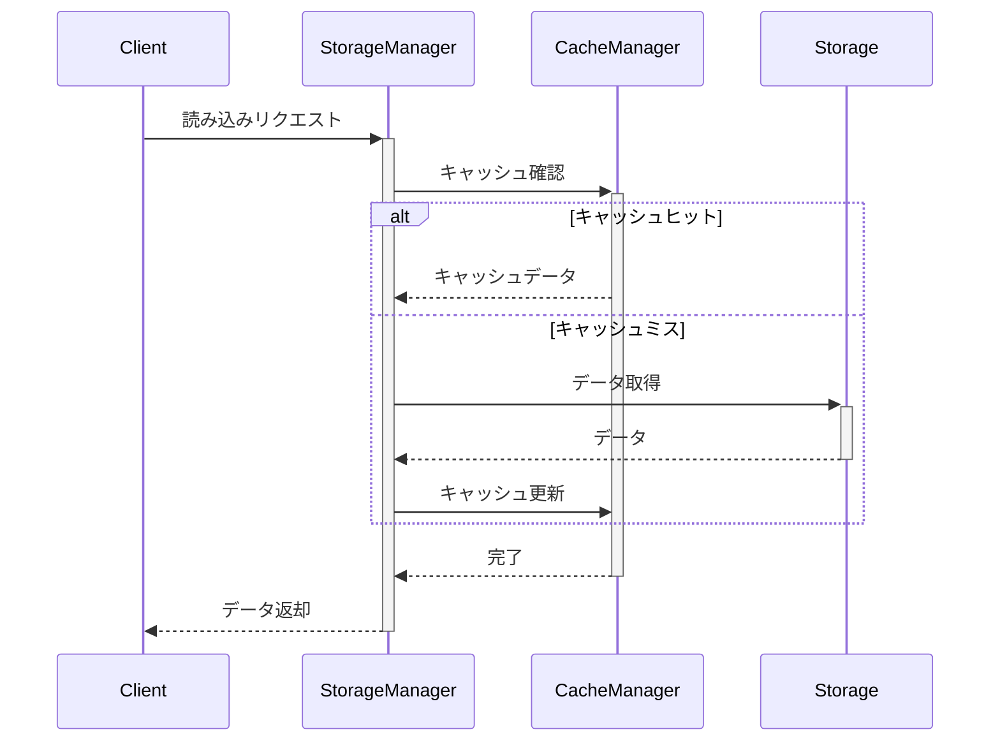

# Persistence System Design Document

## Design Principles

### 1. 信頼性 (Reliability)
- データの一貫性保証
- 自動バックアップ
- エラーリカバリー機能

### 2. パフォーマンス (Performance)
- 効率的なデータアクセス
- キャッシング戦略
- 非同期処理の活用

### 3. 拡張性 (Scalability)
- モジュラー設計
- プラグイン可能なストレージバックエンド
- 水平スケーリング対応

### 4. 整合性 (Consistency)
- トランザクション管理
- バージョン管理
- 競合解決戦略

## System Architecture

### 1. コンポーネント構成

```
Persistence System
├── Storage Manager
│   ├── File System Storage
│   ├── Database Storage
│   └── Cloud Storage
├── Cache Manager
│   ├── Memory Cache
│   └── Disk Cache
├── Sync Manager
│   ├── Change Tracker
│   └── Conflict Resolver
└── Backup Manager
    ├── Backup Scheduler
    └── Recovery Handler
```

### 2. データフロー

#### 保存フロー


#### 読み込みフロー


## Core Components

### 1. StorageManager

```typescript
interface StorageManager {
  // 基本操作
  save(data: StorageData): Promise<void>;
  load(id: string): Promise<StorageData>;
  delete(id: string): Promise<void>;
  
  // バッチ操作
  bulkSave(data: StorageData[]): Promise<void>;
  bulkLoad(ids: string[]): Promise<StorageData[]>;
  
  // クエリ
  query(filter: QueryFilter): Promise<StorageData[]>;
  count(filter: QueryFilter): Promise<number>;
  
  // ストレージ管理
  getStorageInfo(): StorageInfo;
  cleanup(): Promise<void>;
}

interface StorageData {
  id: string;
  type: 'canvas' | 'asset' | 'metadata';
  content: any;
  metadata: {
    created: Date;
    modified: Date;
    version: number;
    checksum: string;
  };
}
```

### 2. CacheManager

```typescript
interface CacheManager {
  // キャッシュ操作
  get(key: string): Promise<CacheData | null>;
  set(key: string, data: CacheData): Promise<void>;
  delete(key: string): Promise<void>;
  clear(): Promise<void>;
  
  // キャッシュ制御
  setTTL(key: string, ttl: number): void;
  setMaxSize(size: number): void;
  setPriority(key: string, priority: CachePriority): void;
  
  // 統計
  getStats(): CacheStats;
  getHitRate(): number;
}

type CachePriority = 'low' | 'normal' | 'high';

interface CacheStats {
  hits: number;
  misses: number;
  size: number;
  itemCount: number;
}
```

### 3. SyncManager

```typescript
interface SyncManager {
  // 同期操作
  sync(): Promise<SyncResult>;
  forceSync(): Promise<SyncResult>;
  cancelSync(): void;
  
  // 変更追跡
  trackChanges(changes: Change[]): void;
  getUnsynced(): Change[];
  
  // 競合解決
  resolveConflict(conflict: Conflict): Promise<void>;
  getConflicts(): Conflict[];
  
  // 状態管理
  getSyncStatus(): SyncStatus;
  setStrategy(strategy: SyncStrategy): void;
}

interface Change {
  id: string;
  type: ChangeType;
  data: any;
  timestamp: Date;
  author: string;
}

type ChangeType = 'create' | 'update' | 'delete' | 'merge';
```

### 4. BackupManager

```typescript
interface BackupManager {
  // バックアップ操作
  createBackup(type: BackupType): Promise<Backup>;
  restoreBackup(id: string): Promise<void>;
  listBackups(): Promise<Backup[]>;
  
  // スケジュール管理
  scheduleBackup(schedule: BackupSchedule): void;
  cancelSchedule(id: string): void;
  
  // クリーンアップ
  pruneBackups(policy: RetentionPolicy): Promise<void>;
  validateBackups(): Promise<ValidationResult>;
}

type BackupType = 'full' | 'incremental' | 'differential';

interface BackupSchedule {
  type: BackupType;
  interval: number;
  retention: RetentionPolicy;
}
```

## Data Structures

### 1. キャンバスデータ

```typescript
interface CanvasData {
  // 基本情報
  id: string;
  name: string;
  created: Date;
  modified: Date;
  
  // キャンバス状態
  dimensions: {
    width: number;
    height: number;
  };
  viewState: {
    zoom: number;
    pan: Point;
  };
  
  // レイヤー情報
  layers: Layer[];
  activeLayer: string;
  
  // メタデータ
  metadata: {
    author: string;
    tags: string[];
    thumbnail: string;
  };
}
```

### 2. アセットデータ

```typescript
interface AssetData {
  // 基本情報
  id: string;
  type: AssetType;
  name: string;
  size: number;
  
  // コンテンツ
  content: Blob;
  thumbnail?: string;
  
  // メタデータ
  metadata: {
    mimeType: string;
    dimensions?: {
      width: number;
      height: number;
    };
    created: Date;
    modified: Date;
  };
}

type AssetType = 'image' | 'video' | 'audio' | 'document';
```

## Error Handling

### 1. エラータイプ

```typescript
enum StorageError {
  // 基本エラー
  STORAGE_FULL = 'storage_full',
  NOT_FOUND = 'not_found',
  PERMISSION_DENIED = 'permission_denied',
  
  // 同期エラー
  SYNC_FAILED = 'sync_failed',
  CONFLICT_DETECTED = 'conflict_detected',
  
  // データエラー
  INVALID_DATA = 'invalid_data',
  CORRUPTED_DATA = 'corrupted_data',
  
  // バックアップエラー
  BACKUP_FAILED = 'backup_failed',
  RESTORE_FAILED = 'restore_failed',
}
```

### 2. エラー処理

```typescript
interface ErrorHandler {
  // エラー処理
  handleError(error: StorageError, context: any): Promise<void>;
  
  // リカバリー
  attemptRecovery(error: StorageError): Promise<boolean>;
  
  // 通知
  notifyUser(error: StorageError): void;
  
  // ログ
  logError(error: StorageError, context: any): void;
}
```

## Performance Optimization

### 1. キャッシング戦略

```typescript
interface CachingStrategy {
  // キャッシュ決定
  shouldCache(data: StorageData): boolean;
  getCachePriority(data: StorageData): CachePriority;
  
  // キャッシュ管理
  evictItems(): Promise<void>;
  preloadItems(ids: string[]): Promise<void>;
  
  // 最適化
  optimizeCache(): Promise<void>;
}
```

### 2. バッチ処理

```typescript
interface BatchProcessor {
  // バッチ操作
  addToBatch(operation: StorageOperation): void;
  processBatch(): Promise<void>;
  
  // 設定
  setBatchSize(size: number): void;
  setProcessingInterval(ms: number): void;
  
  // 状態
  getBatchStatus(): BatchStatus;
}
```

## Monitoring & Metrics

### 1. パフォーマンスメトリクス

```typescript
interface StorageMetrics {
  // 操作メトリクス
  operations: {
    reads: number;
    writes: number;
    deletes: number;
  };
  
  // パフォーマンス
  performance: {
    averageReadTime: number;
    averageWriteTime: number;
    cacheHitRate: number;
  };
  
  // ストレージ使用量
  storage: {
    total: number;
    used: number;
    available: number;
  };
}
```

### 2. ヘルスチェック

```typescript
interface HealthCheck {
  // チェック実行
  checkHealth(): Promise<HealthStatus>;
  
  // 監視
  startMonitoring(interval: number): void;
  stopMonitoring(): void;
  
  // アラート
  setAlertThresholds(thresholds: HealthThresholds): void;
  getAlerts(): Alert[];
}
```

## Testing Strategy

### 1. ユニットテスト
- コンポーネント単位のテスト
- エッジケースの検証
- エラー処理の確認

### 2. 統合テスト
- コンポーネント間の連携
- データフローの検証
- 非同期処理の確認

### 3. パフォーマンステスト
- 負荷テスト
- スケーラビリティテスト
- 耐久性テスト

## Documentation

### 1. API仕様
- インターフェース定義
- メソッド説明
- エラーコード

### 2. 運用ガイド
- 設定パラメータ
- チューニングガイド
- トラブルシューティング
